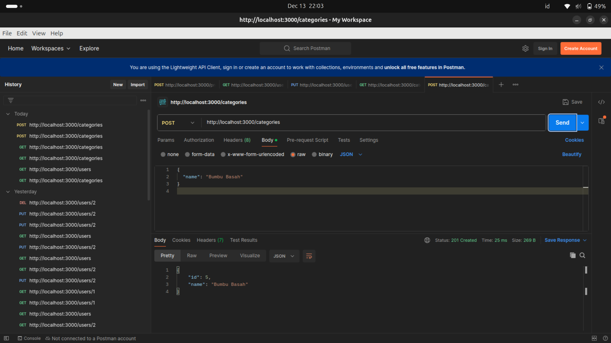
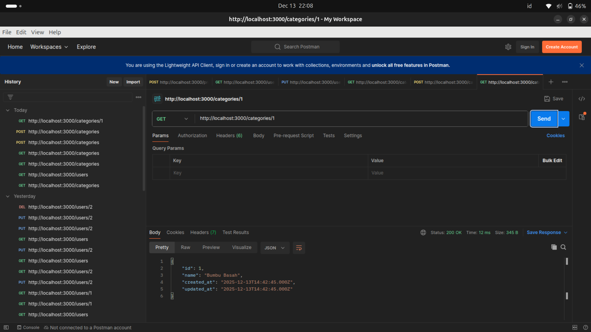
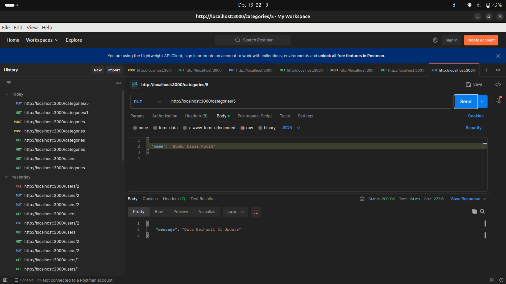
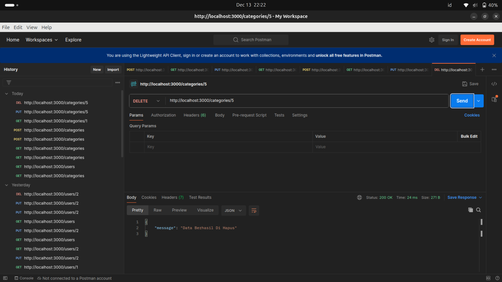
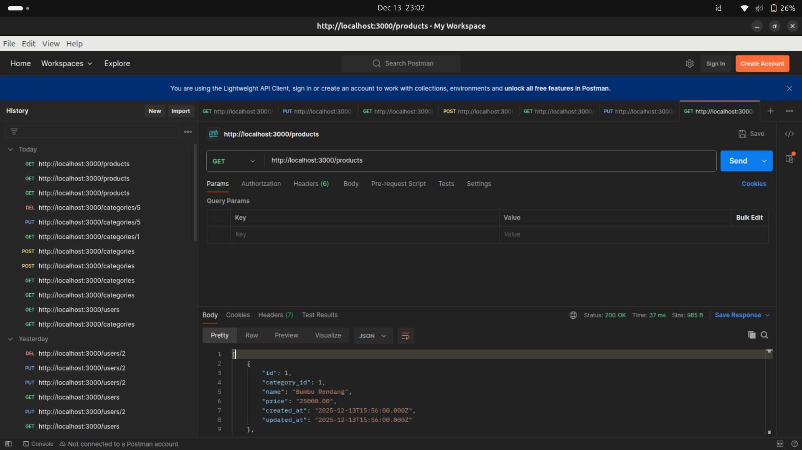
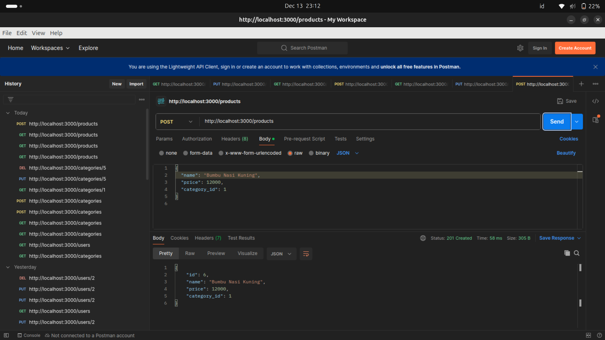
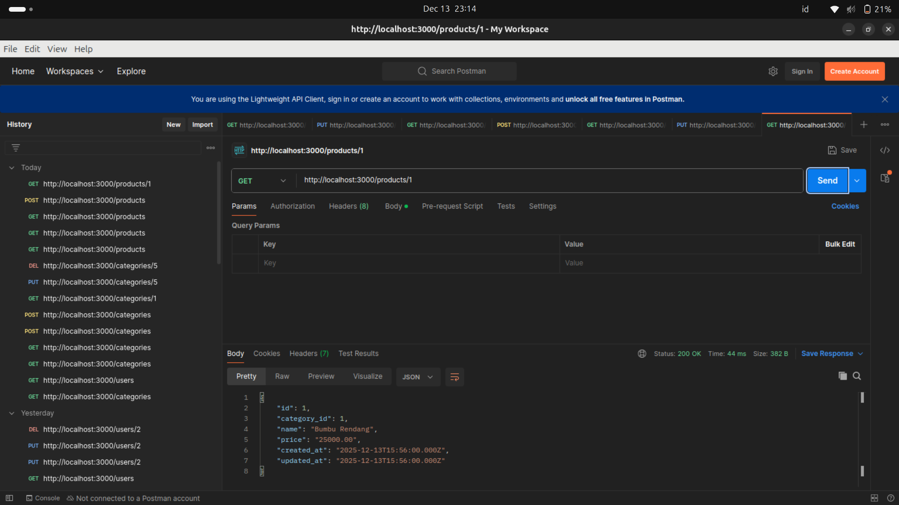
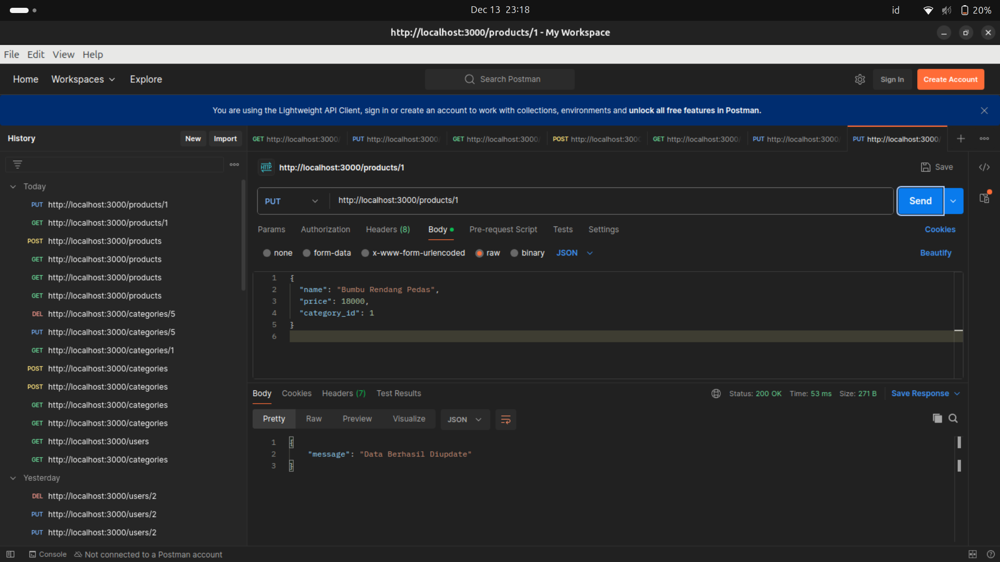
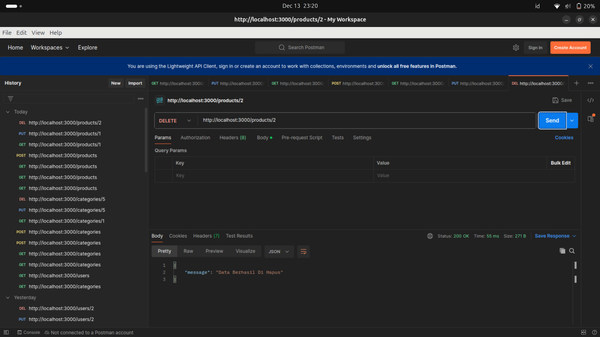

# Tugas Praktikum Node.js & Express.js — CRUD REST API

Project ini merupakan implementasi **REST API CRUD** menggunakan **Node.js & Express.js** untuk mengelola **Users, Categories, dan Products**. Seluruh request dan response menggunakan format **JSON** serta telah diuji menggunakan **Postman**.

---

## Teknologi

* Node.js
* Express.js
* MySQL
* Nodemon
* Dotenv
* Postman

---

## Cara Menjalankan Project

Berikut merupakan langkah-langkah untuk menjalankan projectnya.

### 1. Instalasi Dependencies

Buka terminal pada folder project, kemudian jalankan:

```bash
npm install
```

### 2. Konfigurasi Database (.env)

Buat file **`.env`** di root project, lalu isi dengan konfigurasi berikut (sesuaikan dengan MySQL nya):

```env
PORT=3000
DB_HOST=localhost
DB_USER=root
DB_PASSWORD=password_db_anda
DB_NAME=nama_database_anda
```

**Catatan:**

* Ganti `password_db_anda` dengan password MySQL Anda (kosongkan jika tidak ada).
* Ganti `nama_database_anda` dengan nama database yang digunakan.

### 3. Setup Database (SQL)

Buat database di MySQL, lalu jalankan query berikut:

```sql
-- Buat Database (nama bebas)
CREATE DATABASE bumbu_masak;
USE bumbu_masak;

-- Tabel Users
CREATE TABLE users (
  id INT AUTO_INCREMENT PRIMARY KEY,
  nama VARCHAR(100) NOT NULL,
  email VARCHAR(100) UNIQUE NOT NULL,
  password VARCHAR(255) NOT NULL,
  created_at TIMESTAMP DEFAULT CURRENT_TIMESTAMP
);

-- Tabel Categories
CREATE TABLE categories (
  id INT AUTO_INCREMENT PRIMARY KEY,
  name VARCHAR(100) NOT NULL,
  created_at TIMESTAMP DEFAULT CURRENT_TIMESTAMP,
  updated_at TIMESTAMP DEFAULT CURRENT_TIMESTAMP ON UPDATE CURRENT_TIMESTAMP
);

-- Tabel Products
CREATE TABLE products (
  id INT AUTO_INCREMENT PRIMARY KEY,
  category_id INT NOT NULL,
  name VARCHAR(150) NOT NULL,
  price DECIMAL(10,2) NOT NULL,
  created_at TIMESTAMP DEFAULT CURRENT_TIMESTAMP,
  updated_at TIMESTAMP DEFAULT CURRENT_TIMESTAMP ON UPDATE CURRENT_TIMESTAMP,
  CONSTRAINT fk_category FOREIGN KEY (category_id) REFERENCES categories(id)
);
```

### 4. Menjalankan Server

Jalankan server dengan perintah:

```bash
npm run dev
```

Jika berhasil, akan muncul pesan:

```
Server is running on port http://localhost:3000
Connected to MySQL database
```

---

## API Endpoints

### Users

| Method | Endpoint   | Deskripsi                            |
| ------ | ---------- | ------------------------------------ |
| GET    | /users     | Mengambil semua data user            |
| GET    | /users/:id | Mengambil detail user berdasarkan ID |
| POST   | /users     | Menambahkan user baru                |
| PUT    | /users/:id | Mengupdate data user                 |
| DELETE | /users/:id | Menghapus user                       |

### Categories

| Method | Endpoint        | Deskripsi                 |
| ------ | --------------- | ------------------------- |
| GET    | /categories     | Mengambil semua kategori  |
| GET    | /categories/:id | Mengambil detail kategori |
| POST   | /categories     | Menambahkan kategori      |
| PUT    | /categories/:id | Mengupdate kategori       |
| DELETE | /categories/:id | Menghapus kategori        |

**Contoh Body (POST /categories):**

```json
{ "name": "Bumbu Masak" }
```

### 📦 Products

| Method | Endpoint      | Deskripsi               |
| ------ | ------------- | ----------------------- |
| GET    | /products     | Mengambil semua produk  |
| GET    | /products/:id | Mengambil detail produk |
| POST   | /products     | Menambahkan produk      |
| PUT    | /products/:id | Mengupdate produk       |
| DELETE | /products/:id | Menghapus produk        |

**Contoh Body (POST /products):**

```json
{ "category_id": 1, "name": "Bumbu Basah", "price": 6000 }
```

---

## 🧪 Cara Testing di Postman

1. Buka **Postman** dan buat **Collection** baru.
2. Klik **Add Request**.
3. Pilih **Method** (GET, POST, PUT, DELETE).
4. Masukkan URL:

```
http://localhost:3000/[endpoint]
```

Contoh:

```
http://localhost:3000/products
```

### Untuk Method POST & PUT

* Pilih tab **Body**
* Pilih **raw**
* Ubah format menjadi **JSON**
* Masukkan data JSON

**Contoh Body (POST /products):**

```json
{
  "category_id": 1,
  "name": "Bumbu Kering",
  "price": 5000
}
```

Klik **Send**, lalu periksa response (status **200 / 201** menandakan berhasil).

---

## Dokumentasi Pengujian

Seluruh screenshot hasil pengujian API menggunakan Postman disimpan pada folder **`postman-test/`** sebagai bukti bahwa seluruh endpoint telah berjalan dengan baik.

**Contoh tampilan di README:**

## TAMPILAN CATEGORY

### GET Category


### POST Category



### GET Category By ID



### UPDATE Category



### DELETE Category




## TAMPILAN PRODUCTS

### GET Products



### POST Products



### GET By ID Products



### UPDATE Products



### DELETE Products


---

## Author

**Devita Anggraeni**
Tugas Praktikum Node.js & Express.js
